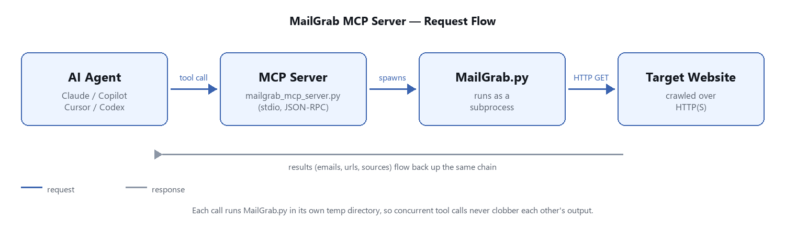

<p align="center" width="100%">
    
    <div align="center">
    <a href="https://www.python.org/downloads/release/python-3912/" title="Go to Python homepage"></a>
      
  <a href="https://github.com/OCEANOFANYTHING/MailGrab/releases/tag/v2.0.0" title="Go to the v2.0.0 release"></a>
  <a target="_blank" href="LICENSE" title="License: MIT"></a>
  <a href="https://www.linux.org/" title="Go to Linux homepage"></a>
  <a href="https://www.apple.com/macos/" title="Go to Apple homepage"></a>
  <a href="https://www.microsoft.com/" title="Go to Microsoft homepage"></a>
	<a href="https://oceanofanything.github.io/MailGrab" title="Go to GitHub Pages homepage"></a>
	
	<div><a href="https://oceanofanything.github.io/MailGrab/" title="Go to project documentation"></a></div>
   </div>
</p>

<p align="center">
  🚀 <strong><a href="https://github.com/OCEANOFANYTHING/MailGrab/releases/tag/v2.0.0">MailGrab v2 Is Here</a> — Packed With More Firepower:</strong> Concurrent Crawling, An MCP Server For AI Agents (Claude, Copilot, Cursor, Codex), <code>robots.txt</code>-Aware Crawling, Email De-Obfuscation, MX Validation, Resume/Append Modes, And A Lot More. See The <a href="https://github.com/OCEANOFANYTHING/MailGrab/releases/tag/v2.0.0">Release Notes</a> For The Full Rundown.
</p>

<div>
  <strong>Just Provide URLs, And It Will Harvest Emails From Those Urls. Not Only One URL , It Will Automatically Find _SubURLs_ From Given URL. It Can Also Find Emails From Thousands Of URLs At One Time. Dont Have Time To Copy All Emails? No Worry! It Will Save All Emails And Harvested URLs In Saperate Text Files. Emails Will Be Saved In *`_emails.txt`* And Scrapped URLs Will Be Saved In *`_scrappedUrls.txt`*. You Can Provide A Huge List Of URLs To Be Scanned. <a href="https://scriptxeno.github.io/posts/mailgrab-the-ultimate-email-scraper/">Read Full Article On This</a></strong>
</div>


##  requirements

  

- Python 3.9+ (keep Scrawling To See Installation Tutorial)

- Windows/Linux/Mac

- Pip3

- Internet Connection (Obviously😜)

  

##  Installation

Clone The Repo From Official Page Of **OCEAN OF ANYTHING OFFICIAL** And Change Directory To MailGrab

```
git clone https://github.com/oceanofanything/MailGrab
cd MailGrab
```

###  Windows

Just Run The `install.bat` File And Wait For The Installation To Complete.

  

```shell
install.bat
```

or

```shell
python -u install.py
```

  

###  Linux

Its Just Simple As That 😎. Just Run The Following Command And Wait For The Installation To Complete🙂.

  
  

```shell
sudo python -u install.py
```

  

> ProTip! It's Necessary To Run Tis In Root Or Sudo

  

###  Mac

  
  
  

#####  Install Python 3.9 (For Kids Who Dont Know How To Install Python 3.9)

  


Go And Visit The Official Page Of Python. Then Install Python On Your System. Make Sure To Install Python Version 3.9.0. To Prevent Any ~~Mistake~~ Please Use Link Bellow

You Can Also Install From This [Link](https://www.python.org/downloads/release/python-390/)

##### For Linux Or Ubuntu

Install Python 3.9 In Linux.

  

1. ##### Step 1 - Install supporting additional packages

```
sudo apt install software-properties-common
```

  

2. ##### Step 2 - Add Deadsnakes Ppa Repository To Install Latest Python 3.9

Open Terminal And Enter The Following Command

```shell
sudo add-apt-repository ppa:deadsnakes/ppa
```

  
  

3. ##### Step 3 - Update Ubuntu/Kali Repository

```
sudo apt update
```

  
  

4. ##### Step 4 - Install latest Python 3 (Version 3.9.0)

```
sudo apt install python3.9
```

  
  

5. ##### Step 5 - Check python version

```shell
python --version
```

##### Installing Pip (Only For Linux Or Ubuntu)

By-default _python3-pip_ is not installed in Ubuntu 20.04 and installing it from **apt** will install old pip package. So let's see step by step installation of latest **python3-pip** **version (20.3.3)**. It will be a two-step process, first, we will install **pip 20.0.2** using the apt repository. Then, download and install the latest pip package i.e. 20.3.3 version.

  

1. ##### Step 1 - Install python3-pip package using apt command

```
sudo apt install python3-pip
```

  
  

2. ##### Step 2 - Check python3-pip version

  

Here pip version 20.0.2 got installed and we need to **upgrade** it to version 20.3.3. Installing package 3.8 from **apt** will help to meet all dependent packages and libraries which will be required for **pip 20.3.3**. If you will skip this step, you may get dependent modules error.

  
  

3. ##### Step 3 - Install **curl** command first.

  

If curl is already installed your system, you can skip this step. Most of the Ubuntu 20.04 don't have curl installed by default. So use **apt install** command to install it. **Curl** is required to execute _step 4_.

  

```shell
sudo apt install curl
```

  
  

4. ##### Step 4 - Download pip from **bootstrap.pypa.io** website

Now you need to **download get pip** from bootstrap.pypa.io website using **curl** command as shown in image.

```shell
curl https://bootstrap.pypa.io/get-pip.py -o get-pip.py
```

  
  

5. ##### Step 5- Upgrade python3-pip version to pip-20.3.3

  

Run **python3.9** command to execute "get-pip.py" package file you downloaded. It will automatically download and install the latest pip in your Ubuntu/Kali Linux.

```shell
sudo python3.9 get-pip.py
```

  
  

6. ##### Step 6 (optional)- Add pip3.9 directory to PATH.

This can be achieved by editing **/etc/environment** file using your favourite editor. Otherwise, exporting and appending "**PATH**" variable for the local user profile will also do the trick. Make sure you add _~/.local/bin/_ in PATH variable.

```
export PATH=~/.local/bin/:$PATH
```

  
  

7. ##### Step 7 - Check pip version

```shell
pip3.9 --version
```

  
  

**Congrats**!! till this point you have installed latest Python 3.9.0 and pip 20.3.3 successfully.

  

#### Install Required Modules

```shell
pip install -r requirements.txt
```

##### For Windows

If You Are On Windows Machine, You Can Just Run `windows.bat` FileTo Start The Program Directly.

You Can Also Do It Manually-

Just Open Powershell Or Command Prompt And Then Type Following Command

```
python -m MailGrab.py
```

##### For Linux

For Linux Users, You Just Have To Type The Same Thing To Terminal.

Just Open Terminal And Type The Following Command

```
python -m MailGrab.py
```

## Usage

MailGrab Is An Easy To Use, User Friendly, Cross Platform And Reliable Tool

### Interactive Mode

Just Run It And Answer The Prompts:

```shell
python MailGrab.py
```

After Launching MailGrab Just Input Url And It Will Automatically Do It's

Work. It Will List All Emails And SubUrls In Terminal, Crawling Concurrently, Respecting `robots.txt` By Default.

> ## !ProTip

You Can Provide A Huge List Of Urls In A File Named `_inputUrls.txt`

. It Will Automatically Detect The File In Current Directory And Will Harvest From The Emails One By One!

***~~This Is A Sicret Please Dont Tell It To Anyone!~~***

### Non-Interactive / Scripted Mode

Every Prompt Has A Matching CLI Flag, So MailGrab Can Run Headless In A Script Or CI Job With No Input At All:

```shell
python MailGrab.py --url https://example.com --depth 20
```

Some Of The Most Used Flags:

| Flag | What It Does |
|---|---|
| `--url` / `--depth` | Skip The Interactive Prompts |
| `--input <file>` | Use A Custom Seed-Url File Instead Of `_inputUrls.txt` |
| `--concurrency <n>` | How Many Pages To Fetch At Once |
| `--same-domain` | Don't Wander Off The Seed Url's Own Domain |
| `--use-sitemap` | Also Seed The Crawl From `sitemap.xml` |
| `--verify-mx` | Drop Emails Whose Domain Has No Mail Server |
| `--append` / `--resume` | Keep Building On A Previous Run Instead Of Starting Over |
| `--quiet` | Print One JSON Summary Line Instead Of The Banner/Console Output |

Run `python MailGrab.py --help` To See Every Flag.

### Output Files

MailGrab Saves Its Findings In The Current Directory Every Run:

- `_emails.txt` / `_scrappedUrls.txt` — Plain Text Lists (The Classic Format)
- `_emails.csv` — Spreadsheet-Friendly, One Row Per Email With The Url It Was Found On
- `_results.json` — Everything In One Structured File (Emails, Urls, Sources, Social/Contact Links) — Also What `--append`/`--resume` Read Back
- `_MailGrabLog.txt` — A Debug Log Of The Run

### Want The Full Picture?

MailGrab Has Grown A Lot Of Knobs — Concurrency Tuning, Rate Limiting, `robots.txt`/`Crawl-delay` Handling, De-Obfuscation, Proxy Support, And More. Every Feature, Every Flag, Every Environment Variable, And What's Actually Happening Behind The Scenes Is Documented In The **[GitHub Wiki](https://github.com/OCEANOFANYTHING/MailGrab/wiki)**.

### Use MailGrab As An MCP Server

MailGrab Also Ships An MCP ([Model Context Protocol](https://modelcontextprotocol.io/)) Server (`mailgrab_mcp_server.py`), So AI Coding Agents Like Claude, GitHub Copilot, Cursor, Or Codex Can Call MailGrab As A Tool Instead Of You Shelling Out To It By Hand. Each Call Runs `MailGrab.py` As Its Own Subprocess In A Private Temp Directory, So Concurrent Tool Calls Never Corrupt The Agent's Stdio Stream Or Clobber Each Other's Output Files.



```shell
python mailgrab_mcp_server.py
```

See The **[GitHub Wiki](https://github.com/OCEANOFANYTHING/MailGrab/wiki)**'s "MCP Server" Page For How To Point Your Agent Of Choice At It.

# Attribute

## This Tool Mail Grab Is Made ***By OCEAN OF ANYTHING*** (***Nakshatra Ranjan Saha***)
